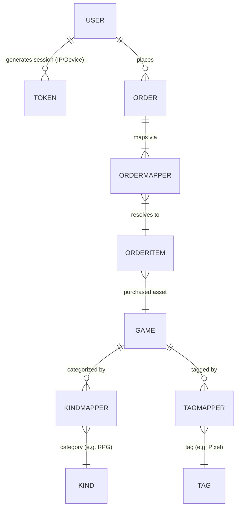
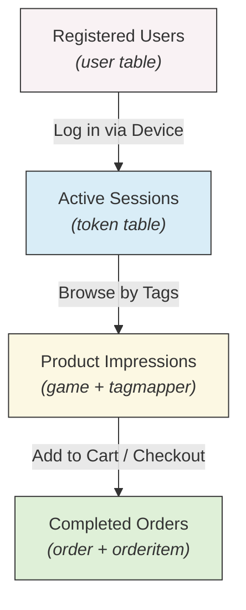

# Game-Distribution-Platform
A 3NF database architecture and advanced SQL analytics portfolio for a digital game distribution platform.


## 📖 Overview

This repository contains the foundational database architecture, offline data ingestion pipelines, and advanced analytical SQL queries for a digital game distribution platform. 

Unlike standard CRUD applications, this project is engineered from a **Data Analytics and Business Intelligence** perspective. It focuses on establishing a robust Third Normal Form (3NF) data model, ensuring rigorous data quality, and enabling deep-funnel commercial metrics tracking (e.g., Session-to-Purchase conversion, ARPU by Game Tag).

---

## 🏗️ 1. Database Architecture (3NF & Data Modeling)

The data foundation is strictly normalized (3NF) to prevent data anomalies and support multidimensional business queries. 

### Core Schema Diagram (ERD)
The following ER diagram maps the exact data relationships from User Sessions (`token`) through to Multi-dimensional Game Categories (`tag`/`kind`) and Financial Transactions (`order`).



## 📊 Analytical Value of Core Entities

### Session Tracking (`token`)

Captures exact login events, including:

- **IP address** (for regional analysis)
- **Device type** (for terminal-specific retention metrics)

This represents the **top of the conversion funnel**.

---

### Multidimensional Metadata (`game`, `kindmapper`, `tagmapper`)

Intermediate mapping tables support **many-to-many relationships**, enabling flexible analytics such as:

**Example:**

- Total revenue of **Pixel-Art FPS games in Q3**

---

### Commercial Transactions (`order`, `orderitem`)

Granular transaction records capture:

- **exact purchase prices**
- **purchased game items**
- **revenue attribution**

These tables form the **bottom of the conversion funnel**.

---

## 🚀 2. Core Analytical Capabilities

Based on this architecture, the system supports **complex business analytics workflows** that transform raw data into **actionable insights**.

---

### Deep Conversion Funnel Flow

We trace user activity across multiple tables to identify **drop-off points** and calculate **conversion rates**.


### Supported Business Metrics
* **End-to-End Conversion:** Tracking users from Registration ➡️ Device Login ➡️ Final Purchase.
* **Cohort & ARPU Analysis:** Slicing revenue data by specific user acquisition cohorts or terminal devices.
* **Tag-Based Monetization Evaluation:** Aggregating sales volume and revenue contribution across different game genres.

---

## 💻 3. Advanced SQL Portfolio

The `business_queries.sql` file contains production-grade SQL scripts demonstrating advanced querying techniques (CTEs, Window Functions, Multi-table JOINs).

**Snippet: End-to-End User Conversion Funnel**

```sql
-- Utilizing CTEs to build a multi-stage funnel from raw underlying tables
WITH ActiveSessions AS (
    SELECT `uid`, COUNT(DISTINCT `token`) AS session_count, MAX(`device`) AS primary_device
    FROM `shop`.`token` 
    GROUP BY `uid`
),
Purchasers AS (
    SELECT o.`uid`, SUM(oi.`price`) AS total_spent
    FROM `shop`.`order` o
    -- 'order' is safely wrapped in backticks to prevent reserved keyword conflicts
    JOIN `shop`.`ordermapper` om ON o.`id` = om.`order`
    JOIN `shop`.`orderitem` oi ON om.`item` = oi.`id`
    GROUP BY o.`uid`
)
-- Example extraction: calculates precise login-to-purchase conversion rates and ARPU
SELECT 
    COUNT(DISTINCT asess.uid) AS `Active Logged-in Users`,
    COUNT(DISTINCT p.uid) AS `Converted Purchasers`,
    ROUND((COUNT(DISTINCT p.uid) / COUNT(DISTINCT asess.uid)) * 100, 2) AS `Conversion Rate (%)`,
    ROUND(AVG(p.total_spent), 2) AS `ARPU`
FROM ActiveSessions asess
LEFT JOIN Purchasers p ON asess.uid = p.uid;
```

*(See `business_queries.sql` for the full query set, including Genre Revenue Contribution using Window Functions).*

---

## 🛡️ 4. Data Quality & Integrity Rule Engine

To ensure downstream dashboards and BI reports are not polluted by "dirty data", the underlying logic dictates strict data governance simulating real-world edge cases:

* **Zombie Order Filtration:** Unpaid orders lingering for >15 minutes are systematically flagged and excluded from revenue calculations to prevent inflated "Intent-to-Buy" metrics.
* **Spam Account Cleansing:** Accounts failing validation within 1 hour are purged, ensuring User Acquisition (UA) metrics represent true active users rather than bot traffic.
* **ACID Financial Logic:** Order updates and code generation are strictly locked to prevent "paid but not delivered" anomalies in our analytical datasets.
