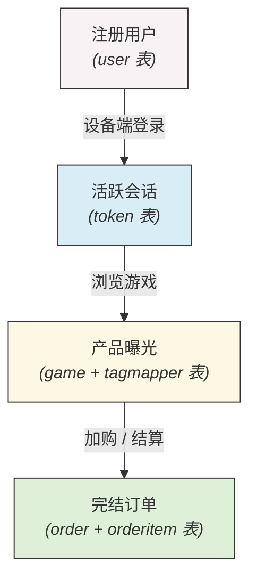

# 🏗️ 游戏分发平台底层数据架构

## 📖 项目简介
本项目从零搭建了一个模拟电子游戏分发平台（类似 Steam/Epic）的关系型数据库架构。项目中包含了完整的表结构设计（Schema）、测试数据，以及用于业务分析的复杂 SQL 查询脚本，主要用于支撑核心业务指标的计算和报表生成。

---

## 🗺️ 实体关系与数据流转

以下是平台核心业务的数据流转路径：


## 🎯 核心功能与业务场景

### 1. 业务指标查询 (Advanced SQL)

通过 `business_queries.sql` 沉淀了业务日常所需的查询逻辑，大量使用了 **CTE (公用表表达式)** 和 **窗口函数 (Window Functions)**。

主要支持以下业务分析：

**端到端转化漏斗**

统计用户从：
账号注册 - 设备登录 - 最终付费

各个环节的转化率，识别用户流失节点并优化产品转化路径。

**ARPU 与留存分析**

按照 **获客渠道** 和 **终端设备** 对用户进行分组，计算：

- 每用户平均收入 (**ARPU**)
- 用户群体的留存和价值差异

**品类营收贡献**

统计不同游戏标签（例如 **RPG、FPS**）的：

- 销量表现
- 总收入贡献
- 品类占比

---

### 2. 数据清洗与逻辑过滤

为了保证下游分析数据的准确性，在底层查询逻辑中加入了严格的数据过滤规则：

**过滤僵尸订单**

自动剔除 **停留超过 15 分钟仍未支付的订单**，避免虚假抬高购买意向指标。

**清理异常账号**

过滤掉 **注册后 1 小时仍未完成验证的账号**，确保 **新增用户（UA）指标**真实反映有效玩家。

**订单一致性检验**

保证：

- 订单支付状态
- 游戏激活码发放

两者之间保持严格的逻辑绑定，防止出现 **“已支付但未发放” 或 “未支付却发放”** 的数据异常。

---

## 💻 核心 SQL 代码示例

使用 **CTE（Common Table Expressions）** 构建用户转化漏斗并计算 **ARPU**：

```SQL
WITH ActiveSessions AS (
    SELECT `uid`, COUNT(DISTINCT `token`) AS session_count, MAX(`device`) AS primary_device
    FROM `shop`.`token` 
    GROUP BY `uid`
),
Purchasers AS (
    SELECT o.`uid`, SUM(oi.`price`) AS total_spent
    FROM `shop`.`order` o
    JOIN `shop`.`ordermapper` om ON o.`id` = om.`order`
    JOIN `shop`.`orderitem` oi ON om.`item` = oi.`id`
    GROUP BY o.`uid`
)
SELECT 
    COUNT(DISTINCT asess.uid) AS `活跃登录用户数`,
    COUNT(DISTINCT p.uid) AS `付费转化用户数`,
    ROUND((COUNT(DISTINCT p.uid) / COUNT(DISTINCT asess.uid)) * 100, 2) AS `转化率 (%)`,
    ROUND(AVG(p.total_spent), 2) AS `ARPU`
FROM ActiveSessions asess
LEFT JOIN Purchasers p ON asess.uid = p.uid;
```
